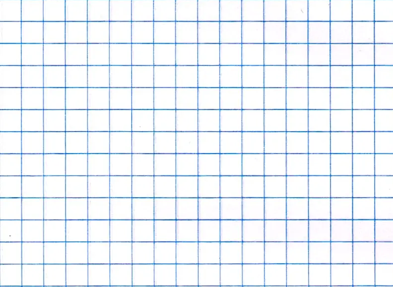
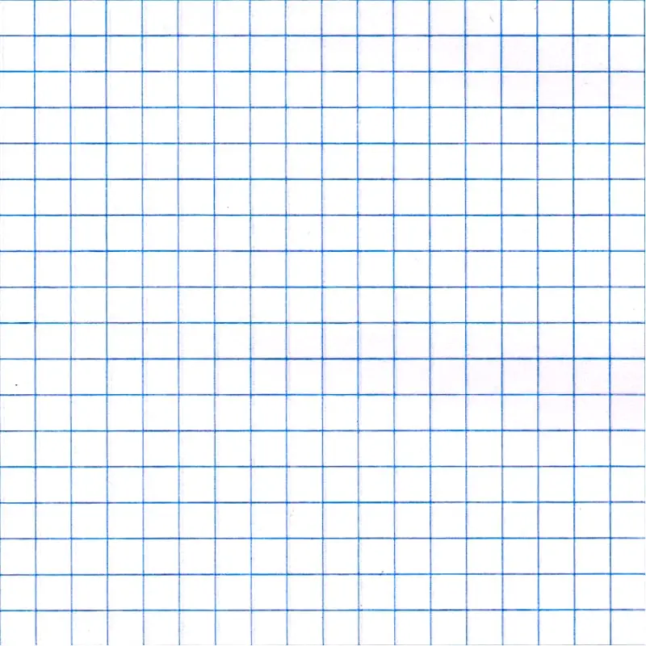

### <div align="center"> **Control Taller de Programación Sección 2**
</div>

**Nombre:** ...........................................................................................................................................................

Resuelva individualmente los siguientes problemas. Puede apoyarse en material escrito o impreso pero **NO** en material digital o Internet.


**1- Sumatoria de una serie geométrica [1.0 pt]**: Escriba un programa en Python que solicite al usuario un número entero positivo \(n\) y calcule e imprima en pantalla el resultado de la sumatoria de la serie geométrica desde \(k=0\) hasta \(n\), según la siguiente fórmula:

$S = \sum_{k=0}^{n} \frac{1}{2^k}$



<div style="page-break-after: always;"></div>



<div style="page-break-after: always;"></div>


**2- Interseccion de listas [1.5 pts]**: A partir de las listas L1 y L2,  calcule la intersección de ellas sin usar sets.

```python
L1 = [1,2,10,4,7, 21,8,3]
L2 = [2,7,1,21,6,9]
```


<div style="page-break-after: always;"></div>


<div style="page-break-after: always;"></div>

**3- Verificación de contraseña [1.5 pts].** Escriba un programa que solicite la creación de una contraseña para un sitio web y verifique que cumple tres reglas mínimas: debe tener un largo minimo de 8 carácteres, debe contener al menos un dígito y debe contener al menos uno de los siguientes caracteres especiales: `'*'`, `'#'`, `'-'`, `'$'`.

Si la contraseña cumple con todas las reglas debe imprimir en pantallla **'Contraseña valida'**, de lo contrario debe imprimir **'Contraseña invalida**'.


<div style="page-break-after: always;"></div>


<div style="page-break-after: always;"></div>

**4- Evaluar Salida [2.0 pts].**: Escriba la salida de este código (valor final de la variable A). Fundamente.

```python
N = 10
A = [True] * N
L = int( N ** 0.5 )     # L = 3 para N = 10
for i in range(2, L):
    if A[i] == True:
        for j in range(2, N // i):
            A[i * j] = False     
print(A)
```

<div style="page-break-after: always;"></div>

<div style="page-break-after: always;"></div>

<div style="page-break-after: always;"></div>


<div style="page-break-after: always;"></div>


